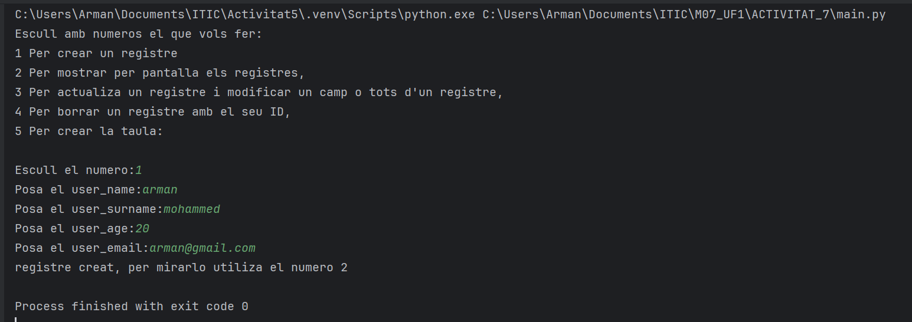
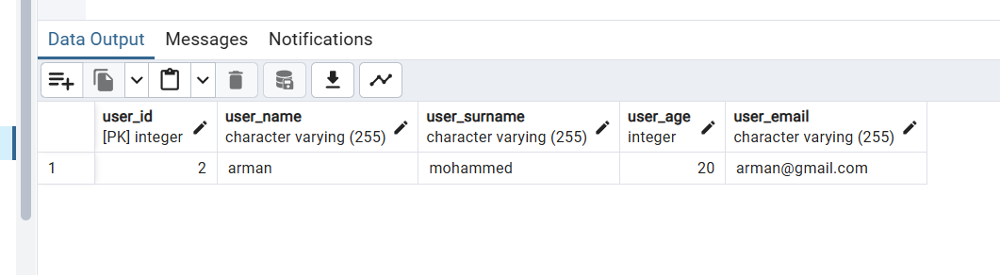
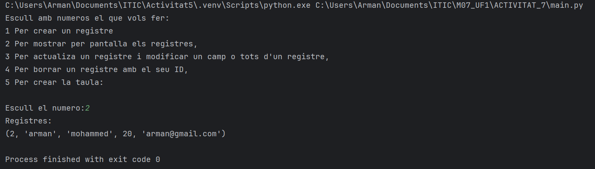
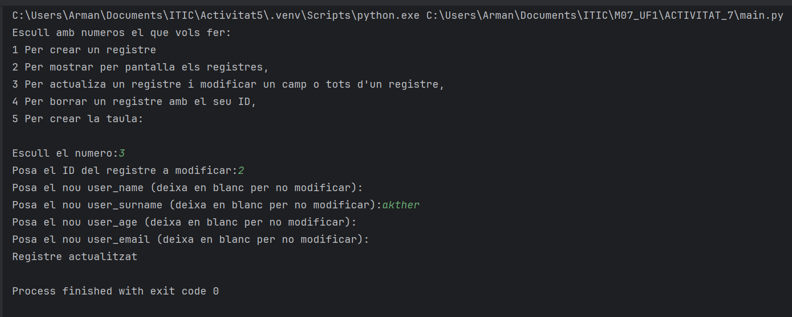
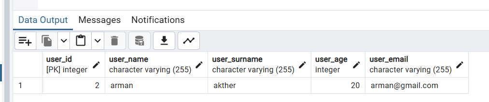
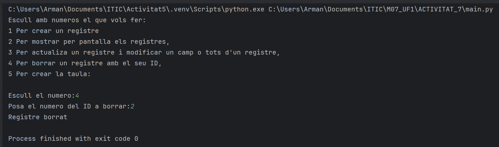
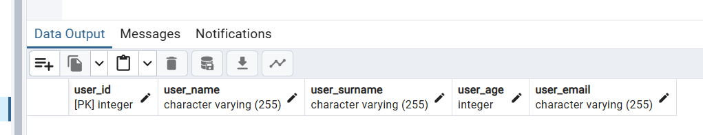
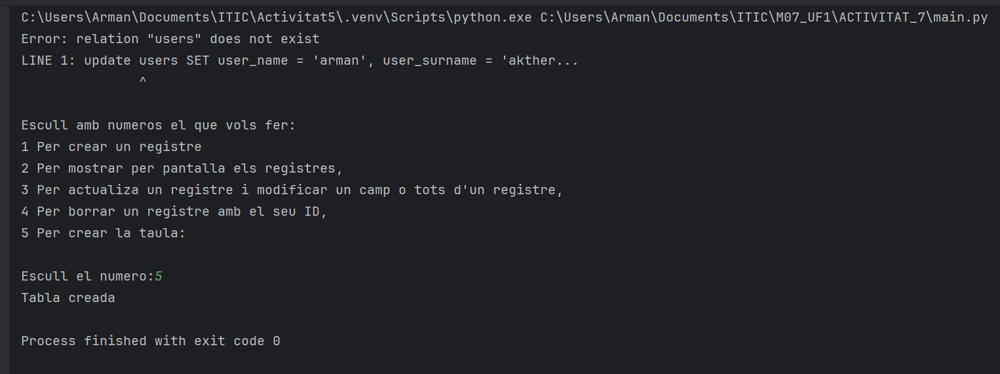
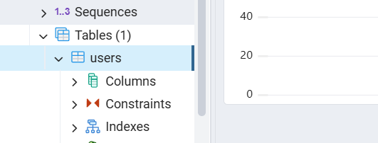

Sortida en el main del create.py:

Sortida en el main del read.py:

Sortida del main del update.py:
Canvio el cognom del anterior registre:

Sortida del main del delete.py:

Sortida del main del create_table.py

